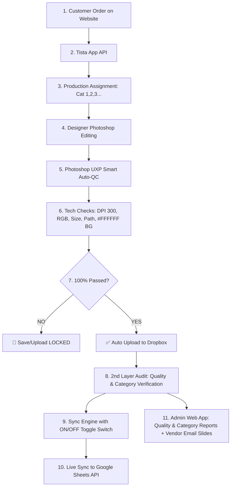

# Photo Editing Automation & Dual Audit Control Suite

Enterprise Quality Control, Auto Data Synchronization, and Dual Audit Control Ecosystem built for high-volume photo editing companies.

---

## 🎓 User Training Manual & Workflow Guides

- 📘 **[ব্যবহারকারী ও টিম ট্রেনিং ম্যানুয়াল (USER_TRAINING_GUIDE.md)](USER_TRAINING_GUIDE.md)** — Management, SM/ASM, QC Auditors, and Photoshop Designers training guide.
- ⚙️ **[সম্পূর্ণ কাজের বিবরণ ও টেকনিক্যাল গাইড (WORKFLOW_GUIDE.md)](WORKFLOW_GUIDE.md)** — End-to-end operational architecture breakdown.

---

## 🌟 Architecture Overview



---

## 🚀 Key User Roles & Modules

1. **Photoshop Designers & Editors (`uxp-plugin/` & `PhotoshopQCSimulator.jsx`):**
   - 100% Automated Technical Inspection: DPI (300 DPI), Color Mode (RGB), Dimensions, Clipping Path (`Path 1`), Pure White `#FFFFFF` Background, and Layer structure checks.
   - **Enforced File Locking:** Prevents completing or uploading edited files to Dropbox until 100% of technical rules and dynamic instructions are checked off.

2. **1st & 2nd Layer QC Auditors (`QualityAuditReport.jsx` & `CategoryAccuracyReport.jsx`):**
   - **All Vendor Summary Table:** Total Order Collect, Audit Quantity, Audit %.
   - **Individual Auditor Performance Table:** Auditor Name, Checked Order Qty, Check %, Found Fault Qty.
   - **Path Quality Audit Insight Table:** Locations/Vendors, Checked Order Qty, Fault Order Qty, Fault Order %, Checked Service Qty, Fault Service Qty, Fault Service %.
   - **Service & Category Accuracy Table:** Service Mismatches, Category Differences (High/Low Diff), and SM/ASM performance tracking.

3. **Production Leads SM / ASM & Managers (`SyncControlBar.jsx`):**
   - Real-time **Sync ON / Sync OFF Toggle Switch** for Google Sheets API integration.

4. **Top Management & Executives (`VendorEmailGenerator.jsx`):**
   - Generates 16:9 HD performance slide decks per vendor.
   - Calculates chargeback deductions ($4.50/fault) and dispatches automated audit statement emails.

---

## 🚀 Quick Start Guide

### Installation & Execution

```bash
# Clone repository
git clone https://github.com/bishojit-byte/Audit-Automation.git
cd Audit-Automation

# Install dependencies
npm install

# Run Vite local development server
npm run dev
```

App will run live at: `http://localhost:5173/`

### Build Production Bundle
```bash
npm run build
```

---

## 📁 Repository Structure

```
├── public/                 # Static public assets
├── src/
│   ├── components/         # Dashboard & Report UI components
│   │   ├── SyncControlBar.jsx
│   │   ├── QualityAuditReport.jsx
│   │   ├── CategoryAccuracyReport.jsx
│   │   ├── PhotoshopQCSimulator.jsx
│   │   ├── VendorEmailGenerator.jsx
│   │   ├── UXPPluginAssetViewer.jsx
│   │   └── ExecutiveDashboard.jsx
│   ├── data/
│   │   └── mockData.js     # Vendor, Auditor & Order dataset
│   ├── App.jsx             # Main Application Layout
│   └── index.css           # Glassmorphism & custom design system
├── uxp-plugin/             # Deployable Adobe Photoshop UXP Plugin
│   ├── manifest.json
│   ├── index.html
│   ├── main.js
│   └── styles.css
├── USER_TRAINING_GUIDE.md  # Role-based User & Team Training Manual
├── WORKFLOW_GUIDE.md       # Complete Operational Workflow Breakdown
└── README.md
```

---

## 📄 License
MIT License. Built for Enterprise Photo Editing Management & Quality Automation.
