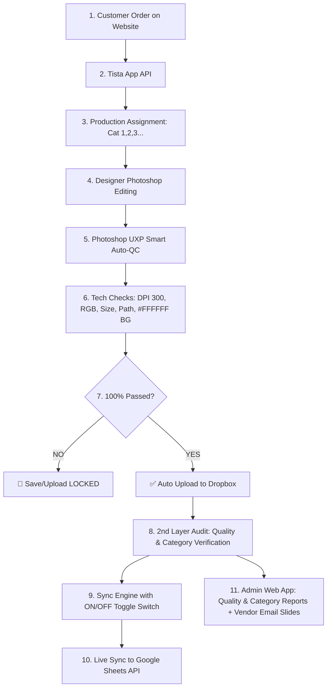

# Photo Editing Automation & Dual Audit Control Suite

Enterprise Quality Control, Auto Data Synchronization, and Dual Audit Control Ecosystem built for high-volume photo editing companies.

---

## 📘 Complete System Workflow Documentation

👉 **[সম্পূর্ণ কাজের বিবরণ ও ওয়ার্কফ্লো গাইড দেখতে এখানে ক্লিক করুন (WORKFLOW_GUIDE.md)](WORKFLOW_GUIDE.md)**

---

## 🌟 Architecture Overview



---

## 🚀 Key Modules Included

1. **Central Data Hub & Sync Engine (`SyncControlBar.jsx`):**
   - Integrates with Tista Job Management REST API and Google Sheets API.
   - Includes a real-time **Sync ON / Sync OFF Toggle Switch** with pending queue management.

2. **Photoshop UXP Smart QC Panel (`uxp-plugin/` & `PhotoshopQCSimulator.jsx`):**
   - Adobe Photoshop Desktop Extension.
   - 100% Automated Technical Inspection: DPI (300 DPI), Color Mode (RGB), Dimensions, Clipping Path (`Path 1`), Pure White `#FFFFFF` Background sampling, and Layer structure checks.
   - **Enforced File Locking:** Prevents completing or uploading edited files to Dropbox until 100% of technical rules and dynamic instructions are checked off.

3. **Quality Audit Report Portal (`QualityAuditReport.jsx`):**
   - **All Vendor Summary Table:** Total Order Collect, Audit Quantity, Audit %.
   - **Individual Auditor Performance Table:** Auditor Name, Checked Order Qty, Check %, Found Fault Qty.
   - **Path Quality Audit Insight Table:** Locations/Vendors, Checked Order Qty, Fault Order Qty, Fault Order %, Checked Service Qty, Fault Service Qty, Fault Service %.
   - **Weekly Quality Audit Comparison Table:** Week-over-Week trend analysis.

4. **Service & Category Accuracy Report Portal (`CategoryAccuracyReport.jsx`):**
   - **Master Summary:** Total Order Collect, Correct Order, Wrong Entry, Service Mismatches (Wrong Service, Service Missing), Category Differences (High Diff, Low Diff), Note Issue.
   - **Individual Lead Performance (SM / ASM):** Detailed breakdown per team lead.
   - **Weekly Comparison Table:** Category and Service Mismatch reduction trends.

5. **Automated Vendor Email & Slide Deck Generator (`VendorEmailGenerator.jsx`):**
   - Generates 16:9 HD performance slide decks per vendor.
   - Calculates chargeback deductions ($4.50/fault) and dispatches automated audit statement emails.

---

## 🚀 Quick Start Guide

### Installation & Execution

```bash
# Clone repository
git clone https://github.com/bishojit-byte/Audit-Automation.git
cd Audit-Automation

# Install dependencies
npm install

# Run Vite local development server
npm run dev
```

App will run live at: `http://localhost:5173/`

### Build Production Bundle
```bash
npm run build
```

---

## 📁 Repository Structure

```
├── public/                 # Static public assets
├── src/
│   ├── components/         # Dashboard & Report UI components
│   │   ├── SyncControlBar.jsx
│   │   ├── QualityAuditReport.jsx
│   │   ├── CategoryAccuracyReport.jsx
│   │   ├── PhotoshopQCSimulator.jsx
│   │   ├── VendorEmailGenerator.jsx
│   │   ├── UXPPluginAssetViewer.jsx
│   │   └── ExecutiveDashboard.jsx
│   ├── data/
│   │   └── mockData.js     # Vendor, Auditor & Order dataset
│   ├── App.jsx             # Main Application Layout
│   └── index.css           # Glassmorphism & custom design system
├── uxp-plugin/             # Deployable Adobe Photoshop UXP Plugin
│   ├── manifest.json
│   ├── index.html
│   ├── main.js
│   └── styles.css
├── WORKFLOW_GUIDE.md       # Complete Bengali/English Operational Workflow Guide
└── README.md
```

---

## 📄 License
MIT License. Built for Enterprise Photo Editing Management & Quality Automation.
