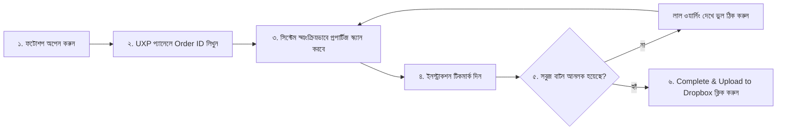
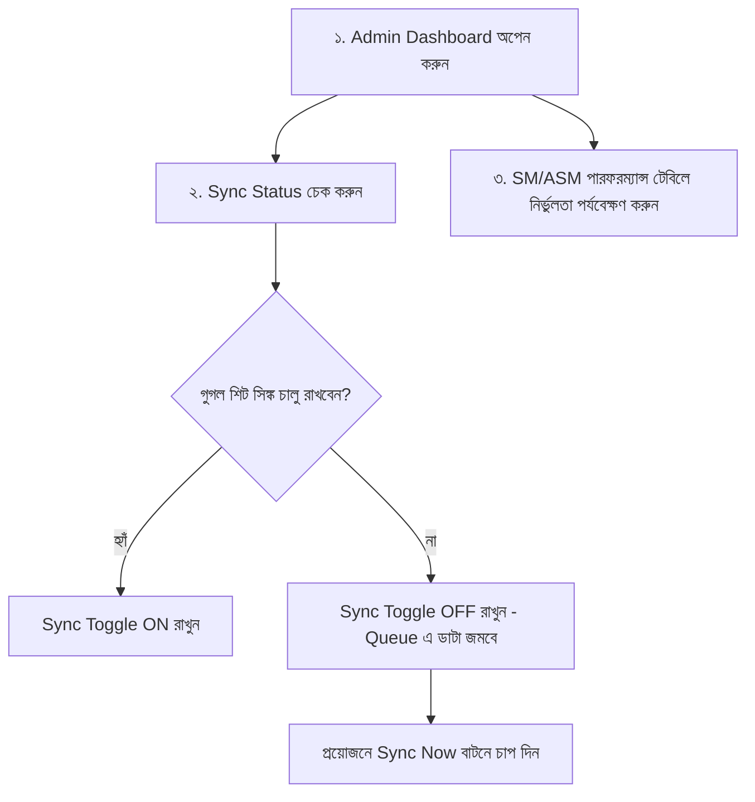

# 🎓 PixelFlow System - Official User & Team Training Manual (ব্যবহারকারী ও টিম ট্রেনিং ম্যানুয়াল)

এই ম্যানুয়ালটি **PixelFlow Application** ব্যবহারকারী সকল পর্যায়ের স্টেকহোল্ডারদের (Top Management থেকে শুরু করে QC Auditor, Production Lead, এবং Designer) জন্য প্রস্তুত করা হয়েছে। টিমের যেকোনো সদস্যকে এই ম্যানুয়ালের মাধ্যমে সিস্টেম ব্যবহারের ট্রেনিং দেওয়া সম্ভব।

---

## 📑 রুল ভিত্তিক সুচিপত্র (Role-Based Table of Contents)

- [১. ডিজাইনার ও ফটোশপ এডিটর গাইড (For Designers & Editors)](#১-ডিজাইনার-ও-ফটোশপ-এডিটর-গাইড-for-designers--editors)
- [২. ১ম ও ২য় লেয়ার QC অডিটর গাইড (For QC Auditors)](#২-১ম-ও-২য়-লেয়ার-qc-অডিটর-গাইড-for-qc-auditors)
- [৩. প্রডাকশন ম্যানেজার, SM ও ASM গাইড (For Production Leads)](#৩-প্রডাকশন-ম্যানেজার-sm-ও-asm-গাইড-for-production-leads)
- [৪. টপ ম্যানেজমেন্ট ও এক্সিকিউটিভ গাইড (For Top Management)](#৪-টপ-ম্যানেজমেন্ট-ও-এক্সিকিউটিভ-গাইড-for-top-management)
- [৫. সচরাচর জিজ্ঞাসিত প্রশ্ন ও ট্রাবলশুটিং (FAQ & Troubleshooting)](#৫-সচরাচর-জিজ্ঞাসিত-প্রশ্ন-ও-ট্রাবলশুটিং-faq--troubleshooting)

---

## ১. ডিজাইনার ও ফটোশপ এডিটর গাইড (For Designers & Editors)

### 🎯 মূল লক্ষ্য: ইমেজের সঠিক টেকনিক্যাল কোয়ালিটি নিশ্চিত করা ও ড্রপবক্সে ফাইল আপলোড করা।

#### 📌 ধাপে ধাপে কাজের নির্দেশিকা:
1. **ফটোশপ অপেনিং:** Adobe Photoshop Desktop অপেন করুন এবং ডানপাশের প্যানেল থেকে **`PixelFlow Smart QC Panel`** চালু করুন।
2. **Order ID ফেচিং:** অর্ডারের কাজ শুরু করার আগে স্ক্রিনের সার্চ বক্সে আপনার **Order ID** (যেমন: `ORD-9824`) ইনপুট দিয়ে **Fetch Specs** বাটনে চাপ দিন।
3. **অটোমেটিক টেকনিক্যাল স্ক্যান:**
   - **Resolution:** ইমেজ ৩০০ DPI আছে কিনা প্যানেল নিজে থেকে সবুজ টিকমার্ক দেবে।
   - **Color Mode:** কালার মোড RGB আছে কিনা চেক করবে।
   - **Clipping Path:** ইমেজে `Path 1` নামের স্মুথ পাথ থাকলে অটো ভেরিফাই হবে।
   - **Background Check:** ইমেজের ব্যাকগ্রাউন্ড খাঁটি সাদা (`#FFFFFF`) আছে কিনা টেস্ট করবে।
4. **ইনস্ট্রাকশন চেকলিস্ট টিকমার্ক:** Tista App থেকে আসা প্রতিটি পয়েন্ট (যেমন: Shadow, Neck Joint) ম্যানুয়ালি এডিট শেষ হলে বক্সে টিকমার্ক দিন।
5. **ফাইল আনলকিং ও ড্রপবক্স আপলোড:**
   - **মনোযোগ দিন:** সবগুলো পয়েন্ট পাস না হওয়া পর্যন্ত ফটোশপের **`Complete & Upload to Dropbox`** বাটন লাল হয়ে লক থাকবে।
   - সব পয়েন্ট সবুজ হলে বাটন আনলক হবে। ক্লিক করার সাথে সাথে ইমেজ ড্রপবক্সে অটো আপলোড হয়ে যাবে:
     `/{Vendor_Name}/{Order_ID}/Complete/`

---

## ২. ১ম ও ২য় লেয়ার QC অডিটর গাইড (For QC Auditors)

### 🎯 মূল লক্ষ্য: ভেন্ডর গাইডলাইন ও সার্ভিস/ক্যাটাগরি নির্ভুলতা ভেরিফাই করা।

#### 📌 ধাপে ধাপে অডিট নির্দেশিকা:
1. **এডমিন পোর্টালে প্রবেশ:** ব্রাউজারে `http://localhost:5173/` অপেন করুন।
2. **Quality Audit Report ট্যাবে যান:**
   - **Auditor Check Count:** প্রতিদিন আপনার অ্যাসাইন করা অর্ডারগুলো চেক করে রেজাল্ট সাবমিট করুন।
   - **Found Fault Entry:** যদি কোনো ভেন্ডর কাস্টমার গাইডলাইন মিস করে, তবে অডিট বক্সে ভুলের ক্যাটাগরি ফ্লাগ করুন।
3. **Service & Category Report ট্যাবে যান:**
   - প্রডাকশন টিম কোনো সাধারণ কাজকে ভুল করে উচ্চ ক্যাটাগরি (Category 3) বা কম ক্যাটাগরি (Category 1) দিয়েছে কিনা তা ভেরিফাই করুন।
   - ভুল হলে **Category Difference (High/Low)** অপশনে এন্ট্রি দিন।

---

## ৩. প্রডাকশন ম্যানেজার, SM ও ASM গাইড (For Production Leads)

### 🎯 মূল লক্ষ্য: টিম পারফরম্যান্স ট্র্যাকিং এবং গুগল শিটস সিঙ্ক মেইনটেইন করা।

#### 📌 ধাপে ধাপে কন্ট্রোল নির্দেশিকা:
1. **Google Sheets Sync Toggle Switch:**
   - স্ক্রিনের ডানদিকের শীর্ষে থাকা **`Auto Sync Toggle Switch`** ব্যবহার করুন।
   - সিঙ্ক চালু থাকলে সবুজ **Sync ON** দেখাবে। নেটওয়ার্ক ধীর থাকলে সুইচ অফ করে রাখুন; কাজ শেষে **`Sync Now`** বাটনে চাপ দিয়ে রিয়েলটাইমে শিটে ডাটা সিঙ্ক করুন।
2. **SM / ASM Performance Summary পর্যালোচনা:**
   - কোন টিম লিড বা এসএসএমের আন্ডারে বেশি সার্ভিস মিসম্যাচ বা ক্যাটাগরি ভুল হচ্ছে তা রিয়েলটাইম টেবিলে মনিটর করুন।

---

## ৪. টপ ম্যানেজমেন্ট ও এক্সিকিউটিভ গাইড (For Top Management)

### 🎯 মূল লক্ষ্য: কোয়ালিটি রেটিং, ওভারঅল এফিসিয়েন্সি এবং ভেন্ডর চার্জব্যাক মনিটরিং।

#### 📌 ধাপে ধাপে এক্সিকিউটিভ নির্দেশিকা:
1. **Executive Overview Dashboard:**
   - মোট অডিট করা অর্ডার সংখ্যা, ভেন্ডরদের গড় কোয়ালিটি স্কোর (যেমন: 98.4%) এবং ক্যাটাগরি ভুল কমার চিত্র পর্যবেক্ষণ করুন।
2. **Vendor Email & Slide Generator (চার্জব্যাক জেনারেটর):**
   - **`Vendor Email & Slides`** ট্যাবে যান।
   - ড্রপডাউন থেকে ভেন্ডরের নাম (যেমন: *Precision Retouch Ltd*) এবং সপ্তাহ নির্বাচন করুন।
   - সিস্টেম স্বয়ংক্রিয়ভাবে ১৬:৯ এইচডি স্লাইড প্রেজেন্টেশন ও **$4.50 per fault** হিসেবে চার্জব্যাক হিসাব করে ফেলবে।
   - **`Dispatch Vendor Audit Email`** বাটনে ক্লিক করলে স্বয়ংক্রিয়ভাবে ভেন্ডরের ইমেইলে স্টেটমেন্ট ও স্লাইড রিপোর্ট চলে যাবে।

---

## ৫. সচরাচর জিজ্ঞাসিত প্রশ্ন ও ট্রাবলশুটিং (FAQ & Troubleshooting)

### ❓ প্রশ্ন ১: ফটোশপে Complete/Upload বাটন কেন লাল হয়ে লক হয়ে আছে?
**উত্তর:** ফটোশপের ইমেজের ৩০০ DPI, RGB, Background #FFFFFF অথবা ইনস্ট্রাকশন চেকলিস্টের কোনো ১টি পয়েন্ট বাকি রয়েছে। সবগুলো সবুজ হওয়ার পরেই বাটন আনলক হবে।

### ❓ প্রশ্ন ২: গুগল শিট সিঙ্ক বন্ধ থাকলে কি ডাটা হারিয়ে যাবে?
**উত্তর:** না! সিঙ্ক অফ থাকলে সব ডাটা লোকাল সেফ কিউ (Queue)-তে জমা থাকবে। সিঙ্ক অন করার সাথে সাথে সব ডাটা শিটে আপডেট হয়ে যাবে।

### ❓ প্রশ্ন ৩: নতুন ডিজাইনার বা ভেন্ডর যুক্ত হলে কোথায় সেটআপ করব?
**উত্তর:** `src/data/mockData.js` বা টিস্টা অ্যাপের অ্যাডমিন প্যানেল থেকে ১ ক্লিকে নতুন ভেন্ডর ও অডিটরের নাম যুক্ত করা যাবে।

---
*PixelFlow Enterprise Training Documentation - Antigravity AI Suite.*
